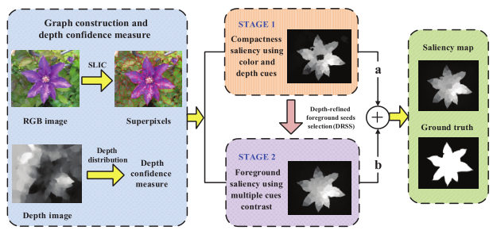

# RGBD Saliency

- [RGBD Saliency](#rgbd-saliency)
  - [2020](#2020)
    - [1 (IEEE TIP) 1 ICNet: Information Conversion Network for RGB-D Based Salient Object Detection](#1-ieee-tip-1-icnet-information-conversion-network-for-rgb-d-based-salient-object-detection)
    - [2 (CVPR) JL-DCF: Joint Learning and Densely-Cooperative Fusion Framework for RGB-D Salient Object Detection](#2-cvpr-jl-dcf-joint-learning-and-densely-cooperative-fusion-framework-for-rgb-d-salient-object-detection)
    - [3 (CVPR) UC-Net: Uncertainty Inspired RGB-D Saliency Detection via Conditional Variational Autoencoders](#3-cvpr-uc-net-uncertainty-inspired-rgb-d-saliency-detection-via-conditional-variational-autoencoders)
    - [4 (CVPR) A2dele: Adaptive and Attentive Depth Distiller for Efficient RGB-D Salient Object Detection](#4-cvpr-a2dele-adaptive-and-attentive-depth-distiller-for-efficient-rgb-d-salient-object-detection)
    - [5 (CVPR) Select, Supplement and Focus for RGB-D Saliency Detection](#5-cvpr-select-supplement-and-focus-for-rgb-d-saliency-detection)
  - [2019](#2019)
    - [1 (submit to IEEE TNNLS) D3Net: Rethinking RGB-D Salient Object Detection: Models, Datasets, and Large-Scale Benchmarks](#1-submit-to-ieee-tnnls-d3net-rethinking-rgb-d-salient-object-detection-models-datasets-and-large-scale-benchmarks)
    - [2 (ICCV) DMRA: Depth-induced Multi-scale Recurrent Attention Network for Saliency Detection](#2-iccv-dmra-depth-induced-multi-scale-recurrent-attention-network-for-saliency-detection)
    - [3 (CVPR) CPFP: Contrast Prior and Fluid Pyramid Integration for RGBD Salient Object Detection](#3-cvpr-cpfp-contrast-prior-and-fluid-pyramid-integration-for-rgbd-salient-object-detection)
    - [4 (arXiv) AFNet: Adaptive Fusion for RGB-D Salient Object Detection](#4-arxiv-afnet-adaptive-fusion-for-rgb-d-salient-object-detection)
    - [5 (TIP) TANet: Three-stream Attention-aware Network for RGB-D Salient Object Detection](#5-tip-tanet-three-stream-attention-aware-network-for-rgb-d-salient-object-detection)
    - [6(PR) MMCI: Multi-modal fusion network with multi-scale multi-path and cross-modal interactions for RGB-D salient object detection](#6pr-mmci-multi-modal-fusion-network-with-multi-scale-multi-path-and-cross-modal-interactions-for-rgb-d-salient-object-detection)
    - [7 (submitted to a journal) PCANet: CNN-based RGB-D Salient Object Detection: Learn, Select and Fuse](#7-submitted-to-a-journal-pcanet-cnn-based-rgb-d-salient-object-detection-learn-select-and-fuse)
    - [8 (ICME) PDNet: Prior-Model Guided Depth-enhanced Network for Salient Object Detectionon](#8-icme-pdnet-prior-model-guided-depth-enhanced-network-for-salient-object-detectionon)
  - [2018](#2018)
    - [1 (CVPR) PCANet: Progressively Complementarity-aware Fusion Network for RGB-D Salient Object Detection](#1-cvpr-pcanet-progressively-complementarity-aware-fusion-network-for-rgb-d-salient-object-detection)
    - [2 (IEEE transactions on cybernetics) CTMF: CNNs-Based RGB-D Saliency Detection via Cross-View Transfer and Multiview Fusion](#2-ieee-transactions-on-cybernetics-ctmf-cnns-based-rgb-d-saliency-detection-via-cross-view-transfer-and-multiview-fusion)
    - [3 (TIP) Co-saliency detection for RGBD images based on multi-constraint feature matching and cross label propagation](#3-tip-co-saliency-detection-for-rgbd-images-based-on-multi-constraint-feature-matching-and-cross-label-propagation)
  - [2017](#2017)
    - [1 (TIP) DF: RGBD Salient Object Detection via Deep Fusion](#1-tip-df-rgbd-salient-object-detection-via-deep-fusion)
    - [2 (ICCV) CDCP: An Innovative Salient Object Detection Using Center-Dark Channel Prior](#2-iccv-cdcp-an-innovative-salient-object-detection-using-center-dark-channel-prior)
    - [3 (ICCV) Learning RGB-D Salient Object Detection using background enclosure, depth contrast, and top-down features](#3-iccv-learning-rgb-d-salient-object-detection-using-background-enclosure-depth-contrast-and-top-down-features)
  - [2016](#2016)
    - [1 (IEEE SIGNAL PROCESSING) DCMC: Saliency Detection for Stereoscopic Images Based on Depth Confidence Analysis and Multiple Cues Fusion](#1-ieee-signal-processing-dcmc-saliency-detection-for-stereoscopic-images-based-on-depth-confidence-analysis-and-multiple-cues-fusion)
  - [Reference](#reference)

## 2020

### 1 (IEEE TIP) 1 ICNet: Information Conversion Network for RGB-D Based Salient Object Detection

paper: https://ieeexplore.ieee.org/stamp/stamp.jsp?tp=&arnumber=9024241

### 2 (CVPR) JL-DCF: Joint Learning and Densely-Cooperative Fusion Framework for RGB-D Salient Object Detection

paper: https://openaccess.thecvf.com/content_CVPR_2020/papers/Fu_JL-DCF_Joint_Learning_and_Densely-Cooperative_Fusion_Framework_for_RGB-D_Salient_CVPR_2020_paper.pdf

### 3 (CVPR) UC-Net: Uncertainty Inspired RGB-D Saliency Detection via Conditional Variational Autoencoders

paper: https://openaccess.thecvf.com/content_CVPR_2020/papers/Zhang_UC-Net_Uncertainty_Inspired_RGB-D_Saliency_Detection_via_Conditional_Variational_Autoencoders_CVPR_2020_paper.pdf

### 4 (CVPR) A2dele: Adaptive and Attentive Depth Distiller for Efficient RGB-D Salient Object Detection

paper: https://openaccess.thecvf.com/content_CVPR_2020/papers/Piao_A2dele_Adaptive_and_Attentive_Depth_Distiller_for_Efficient_RGB-D_Salient_CVPR_2020_paper.pdf

### 5 (CVPR) Select, Supplement and Focus for RGB-D Saliency Detection

paper: https://openaccess.thecvf.com/content_CVPR_2020/papers/Zhang_Select_Supplement_and_Focus_for_RGB-D_Saliency_Detection_CVPR_2020_paper.pdf

## 2019

### 1 (submit to IEEE TNNLS) D3Net: Rethinking RGB-D Salient Object Detection: Models, Datasets, and Large-Scale Benchmarks

paper: https://arxiv.org/pdf/1907.06781.pdf

### 2 (ICCV) DMRA: Depth-induced Multi-scale Recurrent Attention Network for Saliency Detection

paper: http://openaccess.thecvf.com/content_ICCV_2019/papers/Piao_Depth-Induced_Multi-Scale_Recurrent_Attention_Network_for_Saliency_Detection_ICCV_2019_paper.pdf

### 3 (CVPR) CPFP: Contrast Prior and Fluid Pyramid Integration for RGBD Salient Object Detection

paper: https://pdfs.semanticscholar.org/e24f/82fd3ce89994f979cc59efe3dc010be894dd.pdf

### 4 (arXiv) AFNet: Adaptive Fusion for RGB-D Salient Object Detection

paper: https://arxiv.org/pdf/1901.01369.pdf

### 5 (TIP) TANet: Three-stream Attention-aware Network for RGB-D Salient Object Detection

paper: https://ieeexplore.ieee.org/stamp/stamp.jsp?tp=&arnumber=8603756

### 6(PR) MMCI: Multi-modal fusion network with multi-scale multi-path and cross-modal interactions for RGB-D salient object detection

paper: https://www.sciencedirect.com/science/article/abs/pii/S0031320318303054

### 7 (submitted to a journal) PCANet: CNN-based RGB-D Salient Object Detection: Learn, Select and Fuse

是[Progressively Complementarity-aware Fusion Network for RGB-D Salient Object Detection](#1-cvpr-pca-progressively-complementarity-aware-fusion-network-for-rgb-d-salient-object-detection) Complementarity-aware Fusion Network for RGB-D Salient Object Detection)的期刊版本.

paper: https://arxiv.org/pdf/1909.09309.pdf

### 8 (ICME) PDNet: Prior-Model Guided Depth-enhanced Network for Salient Object Detectionon

paper: https://arxiv.org/pdf/1803.08636.pdf

## 2018

### 1 (CVPR) PCANet: Progressively Complementarity-aware Fusion Network for RGB-D Salient Object Detection

paper: https://ieeexplore.ieee.org/stamp/stamp.jsp?tp=&arnumber=8578420

### 2 (IEEE transactions on cybernetics) CTMF: CNNs-Based RGB-D Saliency Detection via Cross-View Transfer and Multiview Fusion

paper: https://ieeexplore.ieee.org/stamp/stamp.jsp?arnumber=8091125

### 3 (TIP) Co-saliency detection for RGBD images based on multi-constraint feature matching and cross label propagation

paper: https://ieeexplore.ieee.org/stamp/stamp.jsp?tp=&arnumber=8070326

## 2017

### 1 (TIP) DF: RGBD Salient Object Detection via Deep Fusion

paper: https://arxiv.org/pdf/1607.03333.pdf

### 2 (ICCV) CDCP: An Innovative Salient Object Detection Using Center-Dark Channel Prior

### 3 (ICCV) Learning RGB-D Salient Object Detection using background enclosure, depth contrast, and top-down features

paper: https://arxiv.org/pdf/1705.03607.pdf

## 2016

### 1 (IEEE SIGNAL PROCESSING) DCMC: Saliency Detection for Stereoscopic Images Based on Depth Confidence Analysis and Multiple Cues Fusion

## Reference

* https://github.com/jiwei0921/SOD-CNNs-based-code-summary-
